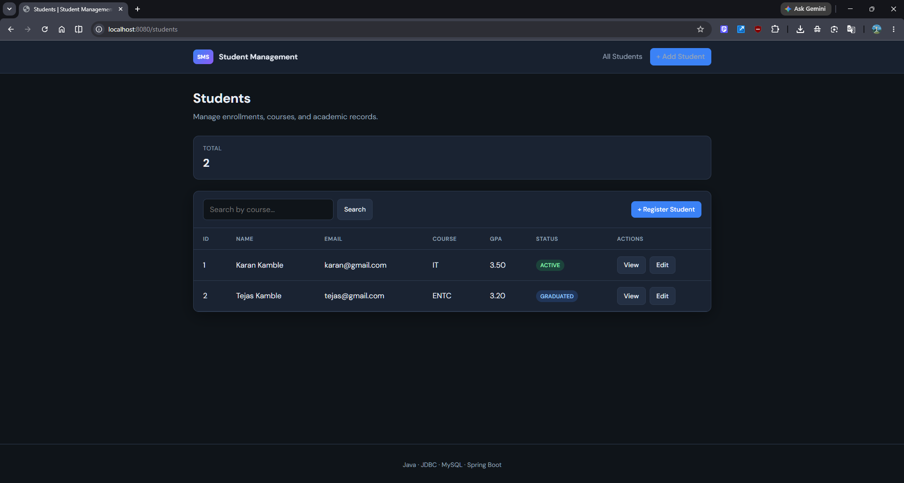
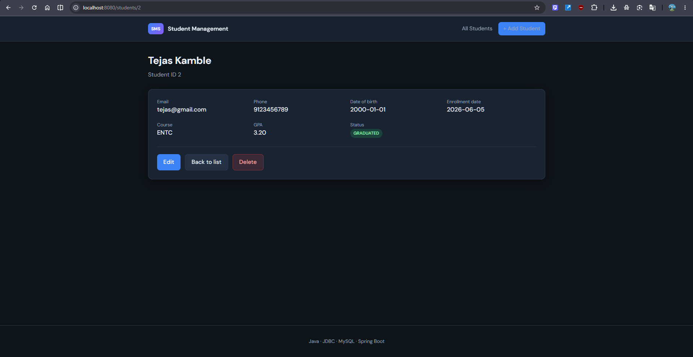
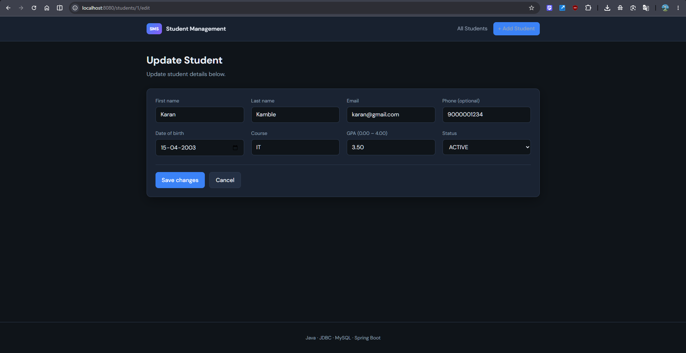

# 🎓 Student Management System

> A modern full-stack Student Management System built with **Java**, **Spring Boot**, **JDBC**, **MySQL**, and **Thymeleaf**.


---

## 🚀 Overview

The Student Management System is a web-based application designed to manage student records efficiently through a modern user interface.

The project demonstrates industry-standard backend development practices including:

* CRUD Operations
* JDBC Database Integration
* Layered Architecture (DAO → Service → Controller)
* Spring Boot MVC
* Input Validation
* Exception Handling
* MySQL Database Design
* Deployment-Ready Configuration

---

## 📸 Application Screenshots

### 🏠 Dashboard


### ➕ Add Student



### ✏️ Edit Student



### 🔄 Update Student



---

## ✨ Features

### Student Management

* Register new students
* View student details
* Update student information
* Delete student records
* Search students by course

### Database Features

* Relational MySQL database design
* Foreign key relationships
* Indexed queries
* Enrollment history tracking
* Data validation constraints

### Security & Validation

* Input validation
* Email validation
* GPA validation
* Structured exception handling
* Clean error reporting

### Deployment Ready

* Spring Boot application
* Docker support
* Railway deployment support
* Render deployment support
* Environment variable configuration

---

## 🛠️ Tech Stack

| Layer       | Technology              |
| ----------- | ----------------------- |
| Backend     | Java 17+, Spring Boot 3 |
| Database    | MySQL 8                 |
| Data Access | JDBC                    |
| Frontend    | Thymeleaf, HTML, CSS    |
| Build Tool  | Maven                   |
| Deployment  | Docker, Railway, Render |

---

## 🏗️ Architecture

```text
Client Browser
       │
       ▼
Spring MVC Controller
       │
       ▼
Service Layer
       │
       ▼
DAO Layer (JDBC)
       │
       ▼
MySQL Database
```

---

## 📂 Project Structure

```text
student-management-system
│
├── screenshots/
│   ├── dashboard.png
│   ├── add-student.png
│   ├── edit-student.png
│   └── update-student.png
│
├── sql/
│   ├── schema.sql
│   └── seed.sql
│
├── src/main/java/com/sms/
│   ├── dao/
│   ├── service/
│   ├── web/
│   ├── model/
│   ├── util/
│   ├── exception/
│   └── SmsApplication.java
│
├── src/main/resources/
│   ├── templates/
│   ├── static/
│   └── application.properties.example
│
├── Dockerfile
├── DEPLOYMENT.md
├── pom.xml
└── README.md
```

---

## ⚙️ Local Setup

### Prerequisites

* Java 17+
* Maven 3.9+
* MySQL 8+

### Database Setup

```sql
CREATE DATABASE student_management;
```

Run schema:

```bash
mysql -u root -p < sql/schema.sql
```

Optional sample data:

```bash
mysql -u root -p < sql/seed.sql
```

---

## 🔧 Configuration

Create:

```text
src/main/resources/application.properties
```

Example:

```properties
spring.datasource.url=jdbc:mysql://localhost:3306/student_management
spring.datasource.username=root
spring.datasource.password=YOUR_PASSWORD
```

---

## ▶️ Run Application

### IntelliJ IDEA

Run:

```text
com.sms.SmsApplication
```

### Maven

```bash
mvn spring-boot:run
```

Open:

```text
http://localhost:8080
```

---

## 🌐 Deployment

Detailed deployment instructions are available in:

```text
DEPLOYMENT.md
```

Supported platforms:

* Railway
* Render
* Docker
* Custom Domains

---

## 🎯 Learning Outcomes

This project demonstrates practical experience with:

* Java Backend Development
* Spring Boot Framework
* JDBC Programming
* MySQL Database Design
* MVC Architecture
* CRUD Application Development
* Exception Handling
* Git & GitHub Workflow
* Web Application Deployment

---

## 👨‍💻 Author

**Karan Kamble**

Final Year B.Tech (Information Technology)

GitHub: https://github.com/GEEKKARAN6713

---

⭐ If you found this project useful, consider starring the repository.
